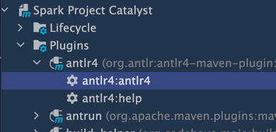
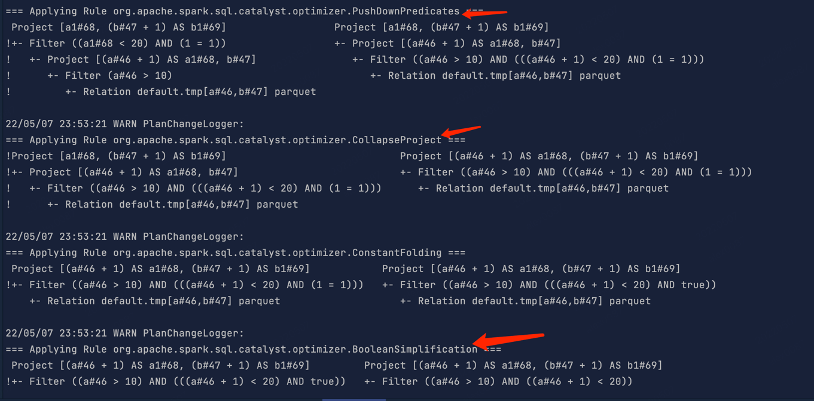
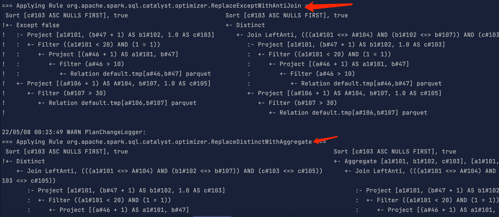
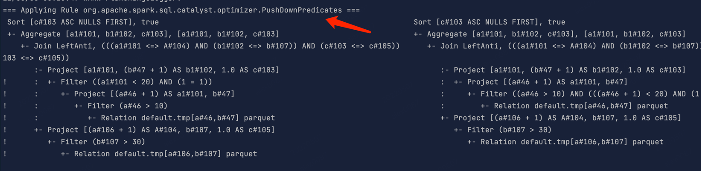
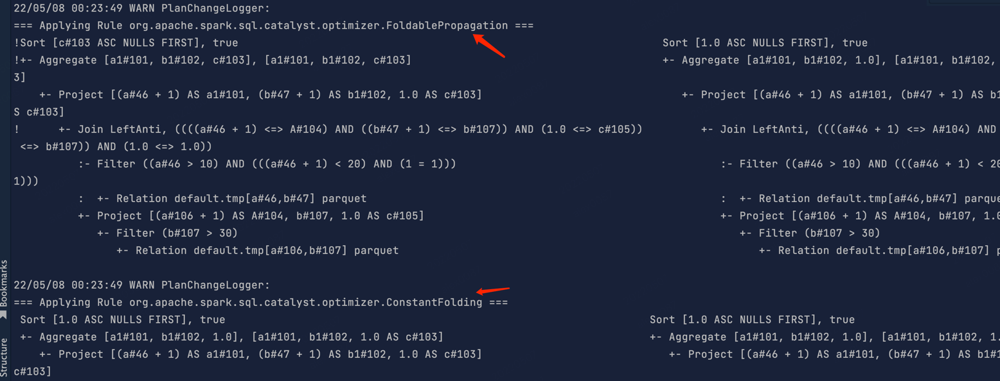
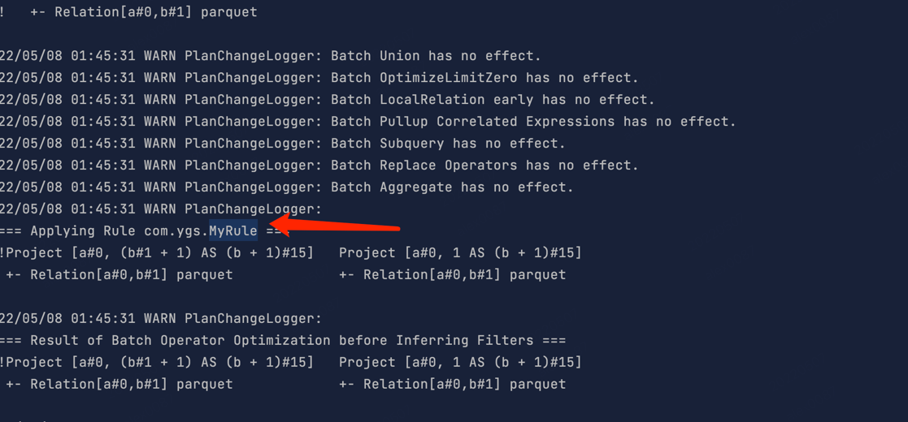

### 1. 为Spark SQL 添加一条自定义命令
#### 先从github拉下 spark项目源码
```shell
git clone https://github.com/apache/spark.git
```
#### 打开spark源码，并从tag v3.2.1切出一个自己的分支
```shell
git branch spark-week9 v3.2.1
git checkout spark-week9
```
#### 找到SqlBase.g4文件, 路径为sql/catalyst/src/main/antlr4/org/apache/spark/sql/catalyst/parser/SqlBase.g4 并添加SHOW VERSION 命令
```antlrv4
statement
    | SHOW VERSION                             #showVersion

ansiNonReserved
    | VERSION

nonReserved
    | VERSION

//--SPARK-KEYWORD-LIST-START
VERSION: 'VERSION';
```
#### 重新执行maven插件 antlr4:antlr4


#### 在路径sql/core/src/main/scala/org/apache/spark/sql/execution/command 下新增ShowVersionCommand类:
```scala
/*
 * Licensed to the Apache Software Foundation (ASF) under one or more
 * contributor license agreements.  See the NOTICE file distributed with
 * this work for additional information regarding copyright ownership.
 * The ASF licenses this file to You under the Apache License, Version 2.0
 * (the "License"); you may not use this file except in compliance with
 * the License.  You may obtain a copy of the License at
 *
 *    http://www.apache.org/licenses/LICENSE-2.0
 *
 * Unless required by applicable law or agreed to in writing, software
 * distributed under the License is distributed on an "AS IS" BASIS,
 * WITHOUT WARRANTIES OR CONDITIONS OF ANY KIND, either express or implied.
 * See the License for the specific language governing permissions and
 * limitations under the License.
 */

package org.apache.spark.sql.execution.command

import org.apache.spark.sql.{Row, SparkSession}
import org.apache.spark.sql.catalyst.expressions.{Attribute, AttributeReference}
import org.apache.spark.sql.types.StringType


case class ShowVersionCommand() extends LeafRunnableCommand {

    override def output: Seq[Attribute] = Seq(AttributeReference("version", StringType)())

    override def run(sparkSession: SparkSession): Seq[Row] = {
        val sparkVersion = sparkSession.version
        val javaVersion = System.getProperty("java.version")
        val outputString = "Spark Version: %s, Java Version: %s".format(sparkVersion, javaVersion)
        Seq(Row(outputString))
    }

}
```
`因为spark项目有代码规范，每个类的header部分需要有类似这种注释`

#### 找到org.apache.spark.sql.execution.SparkSqlParser文件，并新增showVersion的实现方法
```scala

  /**
   * {@inheritDoc  }
   *
   * <p>The default implementation returns the result of calling
   * {@link #   visitChildren} on {@code ctx}.</p>
   */
  override def visitShowVersion(ctx: ShowVersionContext): LogicalPlan = withOrigin(ctx) {
    ShowVersionCommand()
  }
```

#### 最后重新执行maven命令，编译打包整个项目
```shell
mvn clean package -DskipTests -Phive -Phive-thriftserver
```

#### 最后打开/bin/spark-sql，执行show version命令，成功输出版本结果
```shell
22/05/07 20:09:03 WARN Utils: Your hostname, MacBook-Pro.local resolves to a loopback address: 127.0.0.1; using 192.168.1.18 instead (on interface en0)
22/05/07 20:09:03 WARN Utils: Set SPARK_LOCAL_IP if you need to bind to another address
Using Spark's default log4j profile: org/apache/spark/log4j-defaults.properties
Setting default log level to "WARN".
To adjust logging level use sc.setLogLevel(newLevel). For SparkR, use setLogLevel(newLevel).
22/05/07 20:09:03 WARN NativeCodeLoader: Unable to load native-hadoop library for your platform... using builtin-java classes where applicable
22/05/07 20:09:07 WARN HiveConf: HiveConf of name hive.stats.jdbc.timeout does not exist
22/05/07 20:09:07 WARN HiveConf: HiveConf of name hive.stats.retries.wait does not exist
22/05/07 20:09:11 WARN ObjectStore: Version information not found in metastore. hive.metastore.schema.verification is not enabled so recording the schema version 2.3.0
22/05/07 20:09:11 WARN ObjectStore: setMetaStoreSchemaVersion called but recording version is disabled: version = 2.3.0, comment = Set by MetaStore alex0087@127.0.0.1
Spark master: local[*], Application Id: local-1651925345838
spark-sql> show version;
Spark Version: 3.2.1, Java Version: 1.8.0_151
Time taken: 3.23 seconds, Fetched 1 row(s)
```


### 2. 构建 SQL
### 2.1 构建一条 SQL，同时 apply 下面三条优化规则：
- CombineFilters
- CollapseProject
- BooleanSimplification

#### 在spark-sql console中设置 `set spark.sql.planChangeLog.level=WARN;`
#### 执行sql:
```sparksql
CREATE TABLE tmp(a INT, b INT) USING PARQUET;

SELECT a1, (b + 1) AS b1
FROM (
         SELECT (a + 1) AS a1, b FROM tmp WHERE a > 10
     ) WHERE a1 < 20 and 1 = 1;
```
#### 由于谓词下推优化器 包含了三个规则：
```scala
object PushDownPredicates extends Rule[LogicalPlan] with PredicateHelper {
  def apply(plan: LogicalPlan): LogicalPlan = plan.transformWithPruning(
    _.containsAnyPattern(FILTER, JOIN)) {
    CombineFilters.applyLocally
      .orElse(PushPredicateThroughNonJoin.applyLocally)
      .orElse(PushPredicateThroughJoin.applyLocally)
  }
}
```

#### 所以命中PushDownPredicates 等于命中CombineFilters，最终结果为：



### 2.2 构建一条 SQL，同时 apply 下面五条优化规则：
- ConstantFolding
- PushDownPredicates
- ReplaceDistinctWithAggregate
- ReplaceExceptWithAntiJoin
- FoldablePropagation

#### 在spark-sql console中设置 `set spark.sql.planChangeLog.level=WARN;`
#### 执行SQL：
```sparksql
CREATE TABLE tmp(a INT, b INT) USING PARQUET;

SELECT a1, (b + 1) AS b1, 1.0 as c
FROM (
SELECT (a + 1) AS a1, b FROM tmp WHERE a > 10
) WHERE a1 < 20 and 1 = 1
EXCEPT DISTINCT SELECT (a + 1) as A, b, 1.0 as c from tmp where b > 30 order by c;
```
#### 最终输出结果成功命中5条规则：




### 3. 实现自定义优化规则（静默规则）
#### 具体自定义规则代码在MyRule.scala 和 MySparkSessionExtension.scala 类文件里
#### 把scala文件打包成jar包
```shell
mvn clean scala:compile package -DskipTests
```
#### 完成打包后执行命令
```shell
spark-sql --jars target/week9-1.0-SNAPSHOT.jar --conf spark.sql.extensions=com.ygs.MySparkSessionExtension
```
#### 在spark-sql console里执行命令 `set spark.sql.planChangeLog.level=WARN;`
#### 执行sql:
```sparksql
CREATE TABLE tmp(a INT, b INT) USING PARQUET;

SELECT a, b + 1 from tmp;
```
#### 会在log里看到自定义的MyRule规则：


